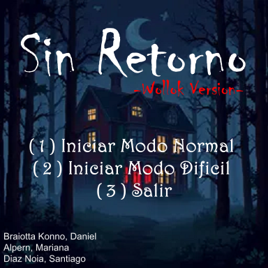
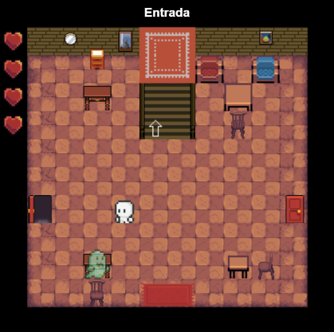
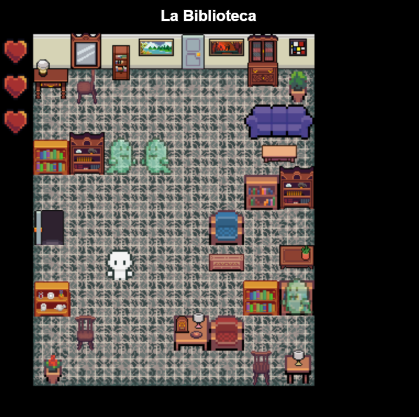
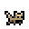

# 

# Un juego creado por:

##  - Braiotta Konno, Daniel - [@DanielBraiotta](https://github.com/DanielBraiotta) <br>  Alpern, Mariana Lucía - [@AlpernMariana](https://github.com/AlpernMariana) <br>  Díaz Noia, Santiago - [@Sadino07](https://github.com/Sadino07) <br> 


    


##  Katy, tu inquieta gata, se ha escapado y ha entrado en una misteriosa mansión abandonada. Al seguirla, la puerta se cierra tras de ti, dejándote atrapado en un lugar lleno de enigmas y secretos. Tu objetivo será encontrar objetos, recolectar llaves, resolver rompecabezas y buscar mensajes ocultos para seguir avanzando. Pero cuidado: todo lo que encuentres tendrá un propósito, y necesitarás prestar mucha atención a las pistas. Al final de tu recorrido, tendrás que enfrentar al “culpable” en un desafío crucial: resolverlo será única manera de escapar y salvar a Katy. <br> <br> - Prepárate para un viaje el cual tal vez no tenga retorno - <br>

# Reglas de juego:<br> 
## •	Debes desplazarte por cada habitación evitando tocar a los fantasmas y buscar elementos que te ayuden a desbloquear puertas para poder avanzar.<br>
# Controles:
## •	Utiliza las teclas “W A S D” para moverte por el tablero.
# Características:<br>
## •	Cada habitación de la mansión es un tablero único con secretos diferentes.
## •	En el Modo Difícil hay mas fantasmas, algunos objetos cambian su ubicación y hay objetos secretos coleccionables. 
# Versión de wollok: VSCode.
# Consejos:<br>
## •	Debes revisar cada rincón de la mansión varias veces de ser necesario. Es posible que encuentres algún objeto que antes hayas pasado por alto.<br>

# Instalar Sin Retorno<br>
## Clonar el proyecto
```bash
    git clone https://github.com/obj1-unahur-2024s2/TPGameIntegrador-los-stormtrooper.git
```
## Iniciar Sin Retorno

###    Dentro del IDE de tu preferencia, iniciar juego desde ´Run Game´ en /src/titulo.wpgm.
###    Esto generara una URL de localhost, hacer click izquierdo + Ctrl sobre el mismo


-  Programación con Objetos I, UNAHUR
