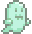

# 

## Un juego creado por:

##  Braiotta Konno, Daniel    Alpern, Mariana Lucía    Díaz Noia, Santiago

 

##  Katty, tu inquieta gata, se ha escapado y ha entrado en una misteriosa mansión abandonada. Al seguirla, la puerta se cierra tras de ti, dejándote atrapado en un lugar lleno de secretos y enigmas. Cada habitación de la mansión es un tablero único con desafíos diferentes. Tu misión será buscar mensajes ocultos, recolectar objetos, encontrar llaves y resolver rompecabezas para seguir avanzando. Pero cuidado: todo lo que encuentres tendrá un propósito, y necesitarás prestar mucha atención a las pistas. Al final de tu recorrido, te enfrentarás a un desafío crucial: resolverlo es la única manera de escapar y salvar a Katty.
# ¡NO TE OLVIDES QUE ES UNA MANSIÓN ABANDONADA Y HAY FANTASMAS!

-  Programación con Objetos I, UNAHUR
- Versión de wollok
- Una vez terminado, no tenemos problemas en que el repositorio sea público / queremos manternerlo privado
